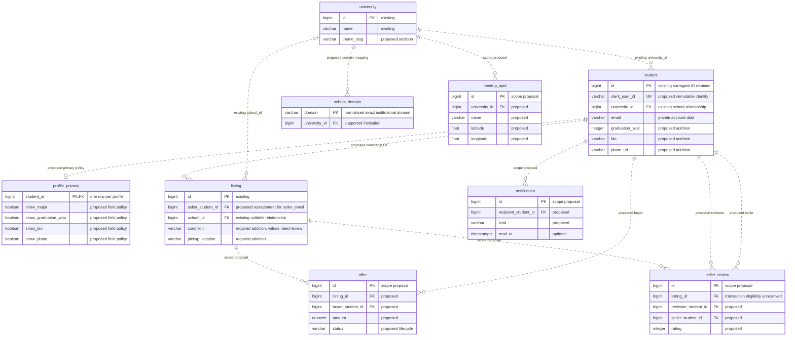

# S0-5 — Current schema and proposed evolution

Prepared 2026-09-16 for review. This is an ERD deliverable, not a migration or a team architecture vote. The [recorded requirements](../../context/1_overview.md), [architecture](../../context/2_architecture.md), and [open decisions](../../context/5_progress.md#open-questions) distinguish required outcomes from possible implementation choices.

## Current physical schema

[Editable Mermaid source: current ERD](erd-current.mmd). It contains all **20 tables, 116 columns and 17 physical foreign keys** from [V1](../../src/main/resources/db/migration/V1__baseline.sql). V2 and V3 insert school and demo student data; they add no tables. This is a migration-source inspection, not an introspection of a deployed database.

All edges in this diagram are database-enforced foreign keys. Dashed edges mean non-identifying relationships in Mermaid notation; they do **not** mean an unenforced logical link. `||` means exactly one parent; `|o` means zero or one; `o{` permits zero or many children. Composite unique constraints are listed below rather than incorrectly marking their individual columns unique. `listing_photo` has no primary key or ordering column in V1.

```mermaid
erDiagram
    %% Current schema: V1__baseline.sql, inspected 2026-09-16.
    %% All edges are physical foreign keys. Email ownership has no edges.
    university {
        bigint id PK "required"
        varchar name UK "required"
    }
    student {
        bigint id PK "required"
        varchar first_name "required"
        varchar last_name "required"
        varchar resident_city "required"
        varchar resident_state "required"
        bigint university_id FK "required"
        varchar grade "required"
        varchar major "required"
        varchar email UK "required"
        varchar social_media_link "nullable"
    }
    app_user {
        bigint id PK "required"
        varchar role "required"
        varchar email UK "required"
        varchar password "nullable"
    }
    listing {
        bigint id PK "required"
        varchar seller_email "required"
        varchar title "required"
        varchar description "nullable"
        varchar category "required"
        varchar listing_type "required"
        varchar status "required"
        numeric price "nullable"
        varchar course_code "nullable"
        bigint school_id FK "nullable"
        timestamptz created_at "required"
        timestamptz updated_at "required"
    }
    listing_photo {
        bigint listing_id FK "required"
        varchar photo_url "nullable"
    }
    listing_favorite {
        bigint id PK "required"
        bigint listing_id FK "required"
        varchar user_email "required"
        timestamptz created_at "required"
    }
    listing_report {
        bigint id PK "required"
        bigint listing_id FK "required"
        varchar reporter_email "required"
        varchar reason "required"
        timestamptz created_at "required"
    }
    conversation {
        bigint id PK "required"
        varchar type "required"
        bigint listing_id FK "nullable"
        timestamptz created_at "required"
    }
    conversation_participant {
        bigint id PK "required"
        bigint conversation_id FK "required"
        varchar user_email "required"
        integer unread_count "required"
        timestamptz last_read_at "nullable"
    }
    message {
        bigint id PK "required"
        bigint conversation_id FK "required"
        varchar sender_email "required"
        varchar content "required"
        varchar image_url "nullable"
        timestamptz created_at "required"
    }
    blocked_user {
        bigint id PK "required"
        varchar blocker_email "required"
        varchar blocked_email "required"
        timestamptz created_at "required"
    }
    user_report {
        bigint id PK "required"
        varchar reporter_email "required"
        varchar reported_email "required"
        varchar reason "required"
        timestamptz created_at "required"
    }
    app_group {
        bigint id PK "required"
        varchar name "required"
        varchar description "nullable"
        varchar type "required"
        varchar related_value "nullable"
        bigint school_id FK "nullable"
        varchar created_by_email "required"
        timestamptz created_at "required"
    }
    group_membership {
        bigint id PK "required"
        bigint group_id FK "required"
        varchar user_email "required"
        timestamptz joined_at "required"
    }
    post {
        bigint id PK "required"
        varchar author_email "required"
        varchar content "required"
        varchar image_url "nullable"
        bigint group_id FK "nullable"
        boolean pinned "required"
        timestamptz created_at "required"
    }
    post_comment {
        bigint id PK "required"
        bigint post_id FK "required"
        varchar author_email "required"
        varchar content "required"
        timestamptz created_at "required"
    }
    post_like {
        bigint id PK "required"
        bigint post_id FK "required"
        varchar user_email "required"
        timestamptz created_at "required"
    }
    event {
        bigint id PK "required"
        varchar title "required"
        varchar description "nullable"
        varchar location "nullable"
        timestamptz starts_at "required"
        bigint school_id FK "nullable"
        bigint listing_id FK "nullable"
        varchar created_by_email "required"
        timestamptz created_at "required"
    }
    support_resource {
        bigint id PK "required"
        bigint school_id FK "required"
        varchar name "required"
        varchar category "required"
        varchar description "nullable"
        varchar address "nullable"
        varchar contact_info "nullable"
        float latitude "nullable"
        float longitude "nullable"
    }
    anonymous_request {
        bigint id PK "required"
        varchar requester_email "required"
        varchar category "required"
        varchar description "required"
        varchar status "required"
        bigint school_id FK "nullable"
        timestamptz created_at "required"
    }
    university ||..o{ student : "university_id"
    university |o..o{ listing : "school_id"
    listing ||..o{ listing_photo : "listing_id"
    listing ||..o{ listing_favorite : "listing_id"
    listing ||..o{ listing_report : "listing_id"
    listing |o..o{ conversation : "listing_id"
    conversation ||..o{ conversation_participant : "conversation_id"
    conversation ||..o{ message : "conversation_id"
    university |o..o{ app_group : "school_id"
    app_group ||..o{ group_membership : "group_id"
    app_group |o..o{ post : "group_id"
    post ||..o{ post_comment : "post_id"
    post ||..o{ post_like : "post_id"
    university |o..o{ event : "school_id"
    listing |o..o{ event : "listing_id"
    university ||..o{ support_resource : "school_id"
    university |o..o{ anonymous_request : "school_id"
```

### Physical relationship inventory

| Parent | Referencing child.column | Parent required? | On parent deletion |
|---|---|---|---|
| university | student.university_id | Yes | NO ACTION (default) |
| university | listing.school_id | No | SET NULL |
| university | app_group.school_id | No | SET NULL |
| university | event.school_id | No | SET NULL |
| university | support_resource.school_id | Yes | CASCADE |
| university | anonymous_request.school_id | No | SET NULL |
| listing | listing_photo.listing_id | Yes | CASCADE |
| listing | listing_favorite.listing_id | Yes | CASCADE |
| listing | listing_report.listing_id | Yes | CASCADE |
| listing | conversation.listing_id | No | SET NULL |
| listing | event.listing_id | No | SET NULL |
| conversation | conversation_participant.conversation_id | Yes | CASCADE |
| conversation | message.conversation_id | Yes | CASCADE |
| app_group | group_membership.group_id | Yes | CASCADE |
| app_group | post.group_id | No | CASCADE |
| post | post_comment.post_id | Yes | CASCADE |
| post | post_like.post_id | Yes | CASCADE |

Unique constraints: `university.name`, `student.email`, `app_user.email`; and the pairs `(listing_id, user_email)` on `listing_favorite`, `(conversation_id, user_email)` on `conversation_participant`, `(blocker_email, blocked_email)` on `blocked_user`, `(group_id, user_email)` on `group_membership`, and `(post_id, user_email)` on `post_like`. V1 also constrains listing category/type/status, conversation type, group type, support category, and anonymous request category/status with CHECK constraints.

### Logical identity relationships — no physical FK

The current application reads the caller's email from the verified JWT and stores it in these **16 ownership/participant columns**. None references `student` or `app_user` through a foreign key. A profile row is therefore not required by the database for each actor, and changing an email can disconnect ownership.

| Tables | Email columns |
|---|---|
| listing; listing_favorite; listing_report | seller_email; user_email; reporter_email |
| conversation_participant; message | user_email; sender_email |
| blocked_user | blocker_email, blocked_email |
| user_report | reporter_email, reported_email |
| app_group; group_membership | created_by_email; user_email |
| post; post_comment; post_like | author_email; author_email; user_email |
| event; anonymous_request | created_by_email; requester_email |

`student.email` and `app_user.email` are independently unique and have no FK to one another. `app_user.role` does not establish an implemented admin capability; `app_user.password` is nullable legacy data, and Clerk owns credentials. The [School model](../../src/main/java/com/jonathansoriano/enterprisedevgroupproject/school/School.java) maps to `university`, not a separate `school` table. [Listing](../../src/main/java/com/jonathansoriano/enterprisedevgroupproject/marketplace/Listing.java) uses an element collection for `listing_photo`; most other references are scalar IDs even though V1 enforces their FKs.

Other absent relationships matter: `conversation` supports only MARKETPLACE and DIRECT in V1, has no `group_id`, and cannot yet represent a group conversation. `anonymous_request` has no fulfillment/donation link. Global posts have `group_id = NULL`; neither separate school/major feed targeting nor post reports have dedicated schema support. Stored reports lack resolution state and an audit trail; deleting a listing currently cascades its reports. These are implementation gaps, not reasons to lower objectives 7 or 9.

## Planned and proposed schema

[Editable Mermaid source: proposed ERD](erd-planned.mmd). This is a focused **delta concept**, not a replacement full schema: existing tables not shown remain as in the current diagram. Every new field, type, FK, cardinality and lifecycle needs implementation review and a later Flyway migration. All six new table names are already recorded in the architecture; the sketch supplies candidate columns to make the discussion concrete.

| Change | Requirement or plan basis | Decision / earliest work |
|---|---|---|
| `school_domain` → university | Objectives 1 and 2 require verified institutional access and ≥6 schools without per-student setup | S1-01/S1-03; final schools, domains, alias policy, and ADR-014 `.edu` admission breadth unresolved |
| `student.clerk_user_id`; owner references to student IDs | ADR-012 proposes immutable Clerk identity | S1-02; vote and migration/backfill strategy needed |
| `profile_privacy`, profile bio/photo/year | Recorded profile visibility requirement and Sprint 1 plan | S1-06/S1-07; proposed storage shape; private fields filtered server-side |
| `listing.condition`, `pickup_location`; photo ordering/provider metadata | Required listing fields and objective 3 | S3-01; storage vendor decision gates S1-05 |
| University theme slug (or a reviewed equivalent lookup) | Objective 8 | S2-04; official palettes, supported schools and contrast evidence needed |
| `offer`, `seller_review` | Explicit scope additions, outside recorded contract objectives | Sprint 7 proposal; no commitment, no payment processing |
| `notification` | Notification centre is an explicit scope addition | S2-P01 proposal; separate from required chat delivery/unread behavior |
| `meetup_spot` | Campus map is an explicit scope addition | Sprint 9 proposal; no provider/schema choice made here |

The conceptual identity design retains `student.id` as a local FK target and adds a unique Clerk subject for authentication. That is a proposal implementing ADR-012, not an accepted reversal of current email keying. Map JWT `sub` to the local student before authorizing; reject client-supplied ownership. Each of the 16 actor columns above needs a reviewed counterpart and backfill before email ownership can be removed. Legacy records without a proven Clerk match must not be assigned by guesswork. Defaults in `profile_privacy` must fail closed; email, social links and other contact details remain excluded from student-facing responses regardless of a visibility toggle. The directory/contact conflict remains an open team decision.

### Required gaps needing a later schema design

Objectives 7 and 9 still require feed targeting, post reports and actionable moderation. Candidate report resolution columns and a moderation audit table should be designed for Sprints 8/11; these are **new design suggestions**, not additional tables already approved in the architecture. Decide report retention before changing the current CASCADE behavior. Webhook replay protection needs a unique event identity or another durable idempotency mechanism in S1-04. This document does not silently invent tables for those choices.

### Migration acceptance checklist

- Add migrations after the highest version present at implementation time; never edit applied V1–V3.
- Inventory ownership data and duplicate/missing matches before adding NOT NULL or unique constraints. Keep fabricated V3 students distinct from real accounts and remove them with a later migration before real use.
- Verify a fresh Postgres 16 install and upgrade of a populated disposable database; Hibernate validation and application ownership checks must both pass.
- Prove account email changes retain listing/chat/report ownership under the same Clerk subject, while another subject cannot claim the data.
- Validate delete/retention behavior, query indexes and DTO privacy separately. An ERD or Hibernate validation does not prove those outcomes.

## Review status

Source-to-diagram checks cover table, column and FK coverage. The proposed diagram expresses open design choices only. Reviewer, team vote, PR/merge and sprint demo are pending; this artifact does not satisfy those Definition of Done items by itself. See [backlog](backlog.md) for dependencies and [wireframes](wireframes.md) for user-facing flows.
